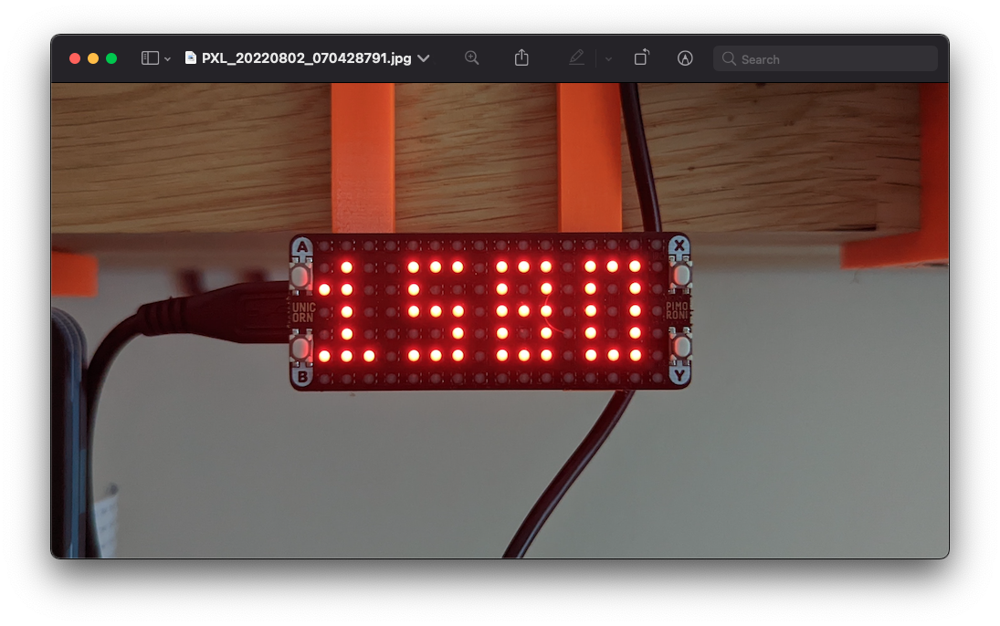

Show the price of crypto with Pico W and the Pimoroni Unicorn Pack!
====

### Prerequisites...

* A Pico W
  * Without headers: https://shop.pimoroni.com/products/raspberry-pi-pico-w?variant=40059369652307
  * With headers: https://shop.pimoroni.com/products/raspberry-pi-pico-w?variant=40059369619539
* Pimoroni Unicorn Pack
  * https://shop.pimoroni.com/products/pico-unicorn-pack?variant=32369501306963

### Setup...

* Ensure you've flashed the latest [Pimoroni Pico W uf2 firmware](https://github.com/pimoroni/pimoroni-pico/releases) to the Pico W. At the time of this repository, it's `1.19.6`.
* Copy `example.secrets.py` to `secrets.py` and change the values.
* Follow the tutorial for connecting [Thonny to the Pico W](https://projects.raspberrypi.org/en/projects/getting-started-with-the-pico/2).
* Copy the files `secrets.py`, `character_map.py` and `main.py` to the Pico W.
* Disconnect your Pico W from your computer.
* Plug into a power source, sit back while the Pico W connects to Wi-Fi and enjoy!

### Encountered an issue?

* Maybe a broken firmware? Try installing the version I used to make this: [`pimoroni-picow-v1.19.6-micropython.uf2`, available here](https://github.com/pimoroni/pimoroni-pico/releases/download/v1.19.6/pimoroni-picow-v1.19.6-micropython.uf2)
* Ensure that the firmware you've flashed is for a Pico W! It contains `-picow-` in the name.
* Made some changes, but you're out of memory? Remember, the Pico has only 264kB of ram, and roughly 180kB of this is usable by you.

### Proposing a change?

Please, feel free to contribute to this repository.
